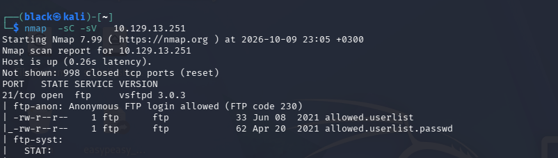
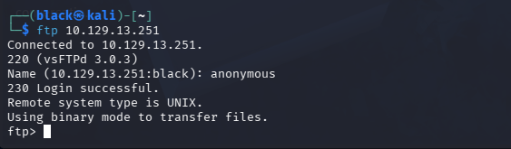

# Hack The Box - FTP Enumeration and Web Discovery Write-up


## Lab Information

This Hack The Box lab focuses on service enumeration, anonymous FTP access, file retrieval, web server identification, and directory brute-forcing.

The exercise demonstrates how misconfigured services and exposed files can reveal useful information about a target machine.

| Category  | Details                                                          |
| --------- | ---------------------------------------------------------------- |
| Platform  | Hack The Box                                                     |
| Target IP | `10.129.13.251`                                                  |
| Services  | FTP, HTTP                                                        |
| Tools     | Nmap, FTP, Gobuster, Web Browser                                 |
| Objective | Enumerate the target and discover the web application login page |

---

## Objective

The objective of this lab was to enumerate the target machine, identify exposed services, investigate anonymous FTP access, download available files, identify the web server version, discover the login page, and retrieve the flag displayed by the web application.

---

## Tools Used

* Nmap
* FTP client
* Gobuster
* Linux terminal
* Web browser

---

# Task 1: Nmap Default Scripts

### Question

**What switch can we use with Nmap to employ default scripts during a scan?**

## Enumeration

I began by scanning the target to identify open ports, running services, and their versions.

```bash
nmap -sC -sV 10.129.13.251
```

### Explanation

* `-sC` runs Nmap's default NSE scripts.
* `-sV` attempts to identify service versions.
* `10.129.13.251` is the target IP address.

The default scripts can help gather additional information about discovered services. In this scan, Nmap's FTP script also checked whether anonymous login was permitted.



### Answer

```text
-sC
```

---

# Task 2: FTP Service Version

### Question

**What service version is found to be running on port 21?**

## Enumeration

During the Nmap scan, port 21 was identified as an open FTP service.

The relevant output was:

```text
21/tcp open ftp vsftpd 3.0.3
```

The `-sV` switch helped identify the software and version running on the port.

### Findings

* Port: `21/tcp`
* Service: FTP
* Software: vsFTPd
* Version: `3.0.3`


### Answer

```text
vsFTPd 3.0.3
```

---

# Task 3: Anonymous FTP Response Code

### Question

**What FTP code is returned for the "Anonymous FTP login allowed" message?**

## Enumeration

The Nmap default script output reported that anonymous FTP login was allowed.

This indicated that the FTP server accepted anonymous authentication, allowing access without a conventional named user account.

The relevant Nmap output was:

```text
ftp-anon: Anonymous FTP login allowed
```

The FTP response code associated with successful authentication was `230`.

### Explanation

FTP uses numerical response codes to indicate the result of commands. A response beginning with `230` indicates that the user has successfully logged in.

### Answer

```text
230
```

---

# Task 4: Anonymous FTP Username

### Question

**After connecting to the FTP server using the FTP client, what username do we provide when prompted to log in anonymously?**

## Connecting to FTP

After identifying anonymous FTP access, I connected directly to the service using the FTP client.

```bash
ftp 10.129.13.251
```

When prompted for a username, I entered:

```text
anonymous
```

The server accepted the login and allowed me to access the FTP directory.



### Findings

Anonymous authentication provided access to the FTP service without using a regular account username.

### Answer

```text
anonymous
```

---

# Task 5: Downloading Files from FTP

### Question

**After connecting to the FTP server anonymously, what command can we use to download the files we find on the FTP server?**

## Listing the FTP Directory

After logging in, I listed the available files using:

```text
ls
```

The FTP server displayed two files:

```text
allowed.userlist
allowed.userlist.passwd
```


## Downloading the Files

I used the FTP `get` command to retrieve both files.

```text
get allowed.userlist
get allowed.userlist.passwd
```

The transfers completed successfully, and the files became available in the local working directory.


### Explanation

The `get` command downloads a specified file from the remote FTP server to the local machine.

### Answer

```text
get
```

---

# Task 6: Username in the Downloaded User List

### Question

**What is one of the higher-privilege-sounding usernames in `allowed.userlist` that we download from the FTP server?**

## Inspecting the Downloaded File

After downloading `allowed.userlist`, I returned to the local terminal and inspected its contents.

```bash
cat allowed.userlist
```

The file contained the following usernames:

```text
aron
pwnmeow
egotisticalsw
admin
```


One of the usernames that sounded associated with a higher level of access was `admin`.

### Security Observation

Exposing user lists through anonymous FTP may give an attacker useful information for further account-targeting attempts.

However, a username that sounds privileged is not necessarily an administrator account, and its presence does not prove that it can authenticate successfully.

### Answer

```text
admin
```

---

# Task 7: Apache HTTP Server Version

### Question

**What version of Apache HTTP Server is running on the target host?**

## HTTP Enumeration

The Nmap scan also identified an HTTP service running on port 80.

The relevant output was:

```text
80/tcp open http Apache httpd 2.4.41 (Ubuntu)
```

The scan identified Apache HTTP Server and reported its version.

The detected page title was:

```text
Smash - Bootstrap Business Template
```


### Findings

* Port: `80/tcp`
* Service: HTTP
* Web server: Apache HTTP Server
* Reported version: `2.4.41 (Ubuntu)`

### Answer

```text
Apache httpd 2.4.41 (Ubuntu)
```

---

# Task 8: Gobuster File Extensions

### Question

**What switch can we use with Gobuster to specify that we are looking for specific file types?**

## Gobuster Enumeration

I used Gobuster to enumerate potential directories and files on the target web server.

```bash
gobuster dir -u http://10.129.13.251/ -w /usr/share/wordlists/dirb/common.txt -x php,html,txt
```

### Explanation

* `dir` selects directory enumeration mode.
* `-u` specifies the target URL.
* `-w` specifies the wordlist.
* `-x` specifies the file extensions to test.

In this scan, I supplied the extensions `php`, `html`, and `txt`.

This allowed Gobuster to test for files such as `login.php`, `login.html`, and `login.txt` based on entries in the wordlist.


### Answer

```text
-x
```

---

# Task 9: Discovering the PHP Login Page

### Question

**Which PHP file can we identify with directory brute force that will provide the opportunity to authenticate to the web service?**

## Investigating the Discovered Endpoint

After running Gobuster with the selected extensions, I identified a PHP login page.

The endpoint was:

```text
/login.php
```

I opened the page in the browser:

```text
http://10.129.13.251/login.php
```

The web page displayed a sign-in form with username and password fields, a “Remember me” checkbox, and a “Sign in” button.


### Findings

The login page provided an authentication endpoint for the web application.

A login page is not automatically a vulnerability. Further testing would be needed to assess its authentication controls, session management, and access restrictions.

### Answer

```text
login.php
```

---

# Task 10: Submit the Single Flag

### Question

**Submit the flag located in the webpage.**

## Flag Retrieval

After completing the enumeration steps, I continued through the lab workflow until the web application displayed the flag.

The screenshot below records the page where the flag was displayed.


### Result

The flag was successfully located in the lab web application.

The flag value has been omitted from this public write-up to avoid exposing the lab answer unnecessarily.

---

# Findings Summary

| Finding          | Description                                                  |
| ---------------- | ------------------------------------------------------------ |
| FTP service      | vsFTPd 3.0.3 was identified on port 21                       |
| Anonymous access | The FTP server permitted anonymous login                     |
| File exposure    | Two user-related files could be downloaded through FTP       |
| HTTP service     | Apache HTTP Server 2.4.41 (Ubuntu) was identified on port 80 |
| Web discovery    | Gobuster identified the `login.php` endpoint                 |

These findings are based on the evidence collected during the exercise. They do not represent a complete assessment of every possible vulnerability on the target.

---

# Security Recommendations

## 1. Secure FTP Access

* Disable anonymous FTP access if it is not required.
* Restrict anonymous users to a dedicated directory containing only intended public files.
* Remove user lists and password-related files from publicly accessible directories.
* Monitor FTP authentication attempts and file downloads.
* Use SFTP or appropriately configured FTPS where suitable.

## 2. Maintain the Web Server

* Apply supported security updates to Apache and the operating system.
* Verify package patch levels instead of relying only on server banners.
* Review web server configuration and file permissions.
* Monitor access logs for suspicious requests.

## 3. Protect the Login Page

* Enforce secure authentication and password storage.
* Apply rate limiting to reduce automated login attempts.
* Use HTTPS in production.
* Configure session cookies securely.
* Ensure protected pages enforce server-side authorization.

---

# Lessons Learned

Through this exercise, I practised:

* Using Nmap to identify open ports and services.
* Running Nmap's default NSE scripts with `-sC`.
* Identifying service versions with `-sV`.
* Interpreting FTP response code `230`.
* Connecting to an FTP server anonymously.
* Listing and downloading remote files with FTP.
* Inspecting downloaded files in Kali Linux.
* Identifying an Apache web server.
* Using Gobuster to enumerate directories and files.
* Specifying file extensions with Gobuster's `-x` switch.
* Discovering a PHP login page through web enumeration.
* Recording findings and making security recommendations.

---

# Conclusion

This Hack The Box lab demonstrated the importance of systematic enumeration when assessing a target machine.

I started by identifying the exposed FTP and HTTP services with Nmap. I then confirmed that anonymous FTP access was permitted, downloaded the available user-related files, and inspected the usernames contained in the user list.

Next, I identified the Apache HTTP Server version and used Gobuster to discover the `login.php` endpoint. Finally, I located the flag displayed by the lab web application.

The main security lesson was that anonymous FTP access can expose information that should not be publicly available. The exercise also reinforced the value of web content discovery and evidence-based reporting.

---

## Suggested Repository Structure

```text
htb-ftp-web-enumeration/
├── README.md
└── images/
    ├── htb-enumeration.png
    ├── pa1.png
    ├── pa2.png
    ├── pa3.png
    ├── pa4.png
    ├── pa5.png
    ├── pa6.png
    ├── pa7.png
    ├── pa8.png
    └── pa9.png
```

Ensure that your screenshot filenames match the image paths in this README. Redact passwords, tokens, and the flag from screenshots before publishing if you want to keep those lab details private.

*This write-up documents an authorized Hack The Box learning exercise.*
